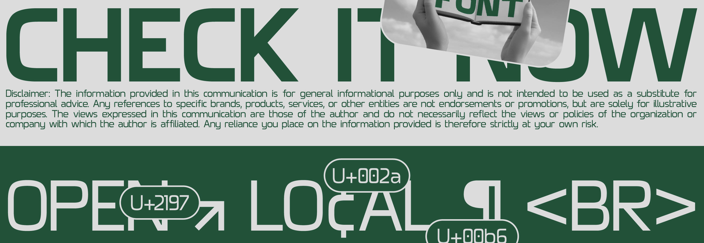
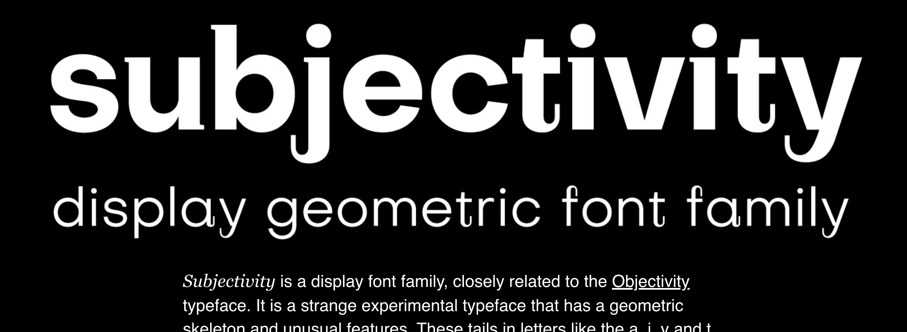
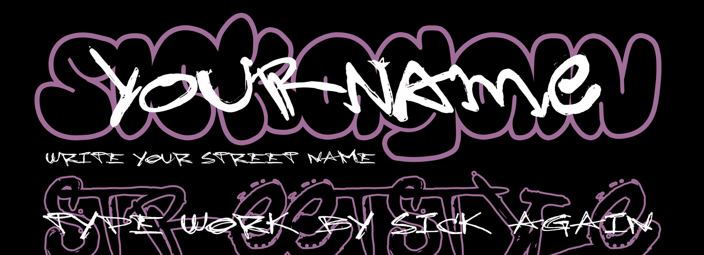

# The Magnificant Movie Tool

Ever felt like you want to watch a movie but **don't know where to start?**
$$\text{WELL, BOY DO I HAVE A SOLUTION FOR YOU}$$
Introducting my project, this is a tool that stores your ***favourite*** movies, uses some *funky* techniques to get some useful information on such movies, **release date**, **actors**, and some silly shots and scenes to **display** and help you out when you are stuck on what movie you want to be watching.

## Dev Info

```bash
bun run start       # runs dev preview
bun run build       # builds
```
`To run the frontend server`

```bash
bun install vite
bun install react-loading-skeleton

# read the below for a loading replacer
# https://www.npmjs.com/package/react-loading-skeleton
```
[loading skeleton npm](https://www.npmjs.com/package/react-loading-skeleton)

`Installs dependancies, should be needed once`

## Font Research


[hatton](https://www.behance.net/gallery/177719125/Hatton-V20-Free-Font?tracking_source=search_projects%7CFree+font)


[airy](https://www.behance.net/gallery/178071809/(FREE)-Airy-3d-Font?tracking_source=search_projects%7CFree+font)


[bloom](https://www.behance.net/gallery/176714005/Bloom-Free-Floral-Display-Font?tracking_source=search_projects%7CFree+font)


[clumster](https://www.behance.net/gallery/174641905/SK-Clumster-Sans-Free-Font?tracking_source=search_projects%7CFree+font)


[roglik](https://www.behance.net/gallery/178767983/Rogik-Expressive-Serif-Font-Family?tracking_source=search_projects%7CFree+font)


[Grissed](https://www.behance.net/gallery/170410573/Grissed-Typeface?tracking_source=search_projects%7CFree+font)


[sunny day](https://www.behance.net/gallery/174931793/SunnyDay-(FREE-FONT)?tracking_source=search_projects%7CFree+font)


[subjectivity](https://www.behance.net/gallery/60555241/Subjectivity-Free-Display-Font-Family?tracking_source=search_projects%7CFree+font)


[Sephyr](https://www.behance.net/gallery/177997399/Sephyr-Free-Display-Typeface?tracking_source=search_projects%7CFree+font)


[wombat](https://www.behance.net/gallery/166034861/WOMBAT-FREE-FONT?tracking_source=search_projects%7CFree+font)


## Roadmap

**Pre Step 1**

- Plan sketch
- Plan backend shite :(

**Step 1:**

- css + Jsx + remove css cuz use tailwind
- grid style, flex style all from a json config file
- setup test images folder
- setup test user json

---
**Step 2:**

- what netflix/neon/amazon/disney/youtube do you use?
- imdb integration - outsource backend?
- google image integration search results for movie and rate each image by how complex their colours are?
- get actors as a list from imdb
- get trailer from most likely youtube seach query result + add button if trailer is wrong
- font match the mood of the film, give each film a rating on romance, violence, gore, action, adventure, horror, drama, chick flick, guy movie, philosophical, art and match font vibe to movie vibe and colour according to the accent found in the poster
- poster manipulation on hover, liquify and distort / translate so it goes from a solid square to a blobby blob 

---
**Step 3:**

- to the cloud, firebase?
- Advertise

---

**Step 4:**

- monetise? 
- always a free version with previous features, but maybe users can pay to get reccomendations for new movies based of previous input. give one of these free each month to all users but more requires a single time  5 dollar donation.

---


# React + TypeScript + Vite

This template provides a minimal setup to get React working in Vite with HMR and some ESLint rules.

Currently, two official plugins are available:

- [@vitejs/plugin-react](https://github.com/vitejs/vite-plugin-react/blob/main/packages/plugin-react/README.md) uses [Babel](https://babeljs.io/) for Fast Refresh
- [@vitejs/plugin-react-swc](https://github.com/vitejs/vite-plugin-react-swc) uses [SWC](https://swc.rs/) for Fast Refresh
